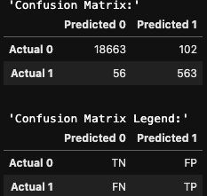
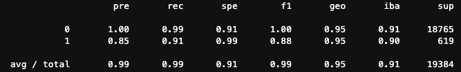
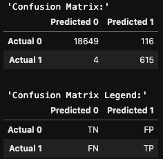
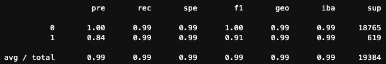

# Module-12-Challenge (Report)

## Credit Risk Logistic Regression

---

 

### <u>Overview of the Analysis</u>

 

<b>Purpose:</b>

The purpose of this analysis was to take a historical loan dataset for a peer-to-peer lending services company and build a model that can identify the creditworthiness of its borrowers. The financial information for each customer - which inevitably became the feature data (X-variables) included the applicants loan size, interest-rate applied to said loan, borrower's income, debt-to-income ratio, number of customer accounts with the lending institution or others, derogatory remarks, & total debt. The target variable was ultimately the loan status (y) binary designation. The program was written in order to implement and test a logistic regression classifier model in order to automate & predict future customer's as 'low-risk' or 'high-risk'.

<b>Process & Variables:</b>

i.) The original data file (lending_data.csv) is read into a Pandas Dataframe and the 'loan_status' column is assigned as the target variable (y) (Note: a value of '0' is considered 'low-risk/healthy' while a '1' designates the loan as 'high-risk' of defaulting). The remaining features (X), as listed above, are stored as a database.
 
 
ii.) The 'balance' is then computed on the y-variable using the 'value_counts' function. This ratio gives an indication as to whether the target data is balanced or imbalanced. This enables the programmer to quantitatively determine whether to perform Random Oversampling/Undersampling if required later on, prior to any Logistic Regression computations.
 
 
iii.) The data is then split into 'training' and 'test' data via the sklearn 'train_test_split' function.
 
 
iv.) With the original unaltered dataset, a logistic regression model (sklearn.linear_model -> LogisticRegression(solver='lbfgs', random_state=1)) is instantiated and fitted with the original split training (X_train & y_train) data parcels. Afterwards, predictions are calculated using the remaining (X_test) testing dataset features. Using this predicted data, the accuracy score of the model can be evaluated along with the aid of the produced confusion matrix & classification report. Results and outputs are analyzed below.
 
 
v.) Afterwards, the process is repeated whereby a RandomOverSampler is instead used (imblearn.over_sampling --> RandomOverSampler(random_state=1)) in order to balance out the y-target variables to remove imbalanced data bias. A new batch of training data points are created from the original features stored in variables 'X_overrsampled' and 'y_overrsampled'.
 
 
vi.) Next, using again the LogisticRegression classifier model the resampled (over-sampled datasets) are fed into the model and new predictions are generated. The model's performance is then evaluated with new outputs for a model accuracy score, confusion matrix and classification report.
 
 

### <u>Results</u>

Using bulleted lists, describe the balanced accuracy scores and the precision and recall scores of all machine learning models.

- Machine Learning Model 1:

  - Description of Model 1 Accuracy, Precision, and Recall scores.

    - Accuracy: 95.21%

    - Precision (Low-Risk Loan) (0): 100%
    - Precision (High-Risk Loan)(1): 85%

    - Recall (Low-Risk Loan) (0): 99%
    - Recall (High-Risk Loan) (1): 91%

    

    
    

    

    
    

The original dataset model when fitted with the Logistic Regression model predicts low-risk loans with 100% precision & 99% recall. However, the model starts to falter when determining whether a customer is a high-risk loan applicant. Precision (TP/(TP + FP)) drops to 85%, meaning 15% (102) of actually healthy-loans were falsely classified as high-risk, and hence, most probably denied. Additionally, the logistic regression model instantiated above has a recall (TP/(TP + FN)) rate of 91% (therefore in inaccurately missed predicting/catching 9% (56) potential high-risk loans, unfortunately).

- Machine Learning Model 2:

  - Description of Model 2 Accuracy, Precision, and Recall scores.

  - Accuracy: 99.37%

    - Precision (Low-Risk Loan) (0): 100%
    - Precision (High-Risk Loan)(1): 84%

    - Recall (Low-Risk Loan) (0): 99%
    - Recall (High-Risk Loan) (1): 99%

    

    
    

    

    
    

The second machine learning model - whereby the RandomOverSampler algorithm has synthetically produced a more balanced dataset which to draw training data target points from was created - produces relatively similar precision scores whereby low-risk loans are precisely predicted 100% of the time, and high-risk lows are identified 84% of the time. This is almost identical to the original data set metrics derived in the first part, above. However, when using the RandomOverSampler algorithm the recall scores for high-risk scores are improved significantly. The recall percentage score jumps to 99%. Therefore, the newer model only missed correctly predicting 1% of the high-risk loans, instead of 9% as before. Hence, less high-risk loan approvals would have been made and saving the bank risk (a reduction of 8%).

### <u>Summary</u>

Therefore, in summary it appears that the Machine Learning Model #2 appears to perform the best - specifically in regards to the reduced errors in false-negative (predicting a good low-risk loan, when in fact it should have been classified as a high-risk potential loan to be flagged and/or denied by the bank). It has an improvement in the recall rate from 91% to 99%.

With regards to the value hierarchy (in whether its more important to predict '1's (high-risk loans) vs '0's (low-risk loans)), it should be noted this program should have been designed with the intention of flagging or ideally, automatically denying high-risk loans. However, it is also important that if this program was set up as just a 'flag' program to identify potential high-risk loans, it is actually decent for that if you utilize the RandomOverSampled -> Logistic Regression approach. Here, very few high-risk loans are incorrectly flagged. But, in both cases the precision is only 84-85%. This means potentially 15-16% of loans were flagged as high-risk when they should not have been. This means if the false-positive high-risk loans (when in fact they're actually low-risk/good loans) are not vetted or analyzed again, the bank is losing upwards of 15-16% of good business.

Therefore, it would be recommended that the Machine Learning Model #2 be used as a program for analysts, but only as a first filtering mechanism. Afterwards, denied loans will then need to be analyzed and deep-dived to pull out the potentially low-risk loan applicants that were initially denied (but should not have been).

So, in conclusion, a two-pronged approach is required when utilizing Model #2, or else, a second program needs to be used in conjunction, or a second stage vetting/analyst process & team needs to be implemented as a safety check to prevent potential lost client business.
